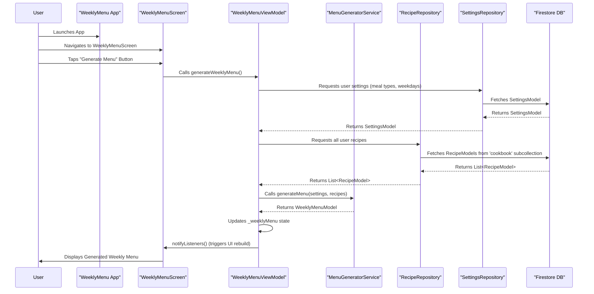

# Modification Design Document: WeeklyMenu Integration Test and Fix

## 1. Overview

This document outlines the design for adding a new integration test to the WeeklyMenu Flutter application. This test will simulate a user logging in, managing recipes, generating a weekly menu, and asserting the successful generation of the menu. The primary goal is to establish a robust test for the weekly menu generation feature and identify the current malfunction in the "generate" button within the `WeeklyMenuScreen`. Subsequently, a fix for the identified malfunction will be designed to ensure the integration test passes.

## 2. Detailed Analysis of the Goal or Problem

The user's request involves two main parts:
1.  **Creating an integration test:** This test needs to cover the full flow of recipe management and weekly menu generation. Specifically, it needs to:
    *   Log in a user.
    *   Delete all existing recipes in the user's cookbook to ensure a clean state for the test.
    *   Add three new, generic test recipes (each with two ingredients and a two-star rating).
    *   Navigate to the Weekly Menu screen.
    *   Tap the "generate" button (identified as a refresh icon in the top-right corner).
    *   Assert that a weekly menu is successfully generated and displayed.
2.  **Fixing the "generate" button functionality:** The user states that the test is expected to fail because the "generate" button in the `WeeklyMenuScreen` does not work correctly. The underlying issue preventing the menu generation needs to be identified and resolved.

### Current State:
*   The application uses Firebase for authentication and Firestore for data storage.
*   `go_router` manages navigation.
*   `Provider` with `ChangeNotifier` is used for state management.
*   Existing integration tests are present in the `integration_test/` directory.

### Problem with "Generate" Button:
The problem description indicates that the "generate" button on the `WeeklyMenuScreen` is not triggering the menu generation logic as expected. This could be due to:
*   The button's `onPressed` handler being incorrectly implemented or missing.
*   Issues in the `WeeklyMenuViewModel` not being properly called or not reacting to the button press.
*   Problems in the `MenuGeneratorService` or its dependencies.
*   UI-related issues preventing the button from being tapped by `flutter_driver` (e.g., being obscured, not visible).

## 3. Alternatives Considered

### For Testing Approach:
*   **Unit Tests:** While unit tests are valuable for isolated logic, they would not adequately cover the end-to-end flow involving UI interaction, navigation, and data persistence (Firebase/Firestore). An integration test is necessary for this scenario.
*   **Widget Tests:** Widget tests could cover the `WeeklyMenuScreen` in isolation, but would not test the full integration with `AuthRepository`, `RecipeRepository`, `WeeklyMenuViewModel`, and `MenuGeneratorService`.

### For Fixing the Generate Button:
*   **Direct code modification without a test:** This is not recommended as it lacks verification. The integration test will serve as a clear objective and a robust verification mechanism for the fix.

## 4. Detailed Design for the Modification

### 4.1. Integration Test (`integration_test/weekly_menu_generation_fix_test.dart`)

A new integration test file will be created. The test will follow these steps:

#### Setup:
1.  **Login:** Use `flutter_driver` to interact with the login screen and log in with known test credentials (e.g., `test@weeklymenu.com`, `12341234`).
2.  **Delete Existing Recipes:** Navigate to the Cookbook screen. Implement a mechanism to identify and delete all recipes currently in the cookbook. This ensures a clean slate for the test's specific recipes. This might involve:
    *   Getting all recipes via `RecipeRepository` (if possible in driver context) or iterating through the UI elements.
    *   Tapping delete buttons for each recipe.
3.  **Add New Recipes:**
    *   Navigate to the Cookbook screen.
    *   Tap the "+" button to add a new recipe.
    *   Enter generic recipe name (e.g., "Test Recipe 1"), two generic ingredients (e.g., "Ingredient A", "Ingredient B"), and set a 2-star rating.
    *   Save the recipe.
    *   Repeat for "Test Recipe 2" and "Test Recipe 3".

#### Action:
1.  **Navigate to Weekly Menu Screen:** Use `flutter_driver` to navigate to the Weekly Menu screen via the bottom navigation bar.
2.  **Tap "Generate" Button:** Identify the refresh icon button in the top-right corner of the `WeeklyMenuScreen` and tap it.

#### Assertion:
1.  **Verify Menu Generation:** After tapping the generate button, the test should wait for a period and then assert that the `WeeklyMenuScreen` displays generated menu items. This can be done by:
    *   Checking for the presence of specific text or widgets that indicate a menu item (e.g., "Breakfast", "Lunch", "Dinner" followed by recipe names).
    *   Verifying that the "No weekly menu generated yet" message is no longer present.

### 4.2. Fixing the "Generate" Button in `WeeklyMenuScreen`

#### Hypothesis:
The "generate" button in `WeeklyMenuScreen` likely isn't correctly invoking the `generateWeeklyMenu` method in `WeeklyMenuViewModel`, or there's an issue with how `WeeklyMenuViewModel` processes this request or updates its state.

#### Proposed Solution:
1.  **Inspect `WeeklyMenuScreen` (`lib/presentation/screens/weekly_menu_screen.dart`):**
    *   Locate the `IconButton` with the refresh icon.
    *   Examine its `onPressed` callback. It should be calling `weeklyMenuViewModel.generateWeeklyMenu()` or a similar function.
    *   Ensure that the `WeeklyMenuViewModel` is correctly provided and accessed within the `WeeklyMenuScreen` widget.
2.  **Inspect `WeeklyMenuViewModel` (`lib/presentation/view_models/weekly_menu_view_model.dart`):**
    *   Verify that the `generateWeeklyMenu` method correctly triggers the `MenuGeneratorService`.
    *   Ensure that the `WeeklyMenuViewModel` notifies listeners (`notifyListeners()`) after the menu has been generated and its internal state (`_weeklyMenu`) has been updated.
    *   Check for any error handling that might be silently failing.
3.  **Inspect `MenuGeneratorService` (`lib/data/services/menu_generator_service.dart`):**
    *   Confirm that the `generateMenu` method contains the correct logic for creating a `WeeklyMenuModel` based on `SettingsModel` and available `RecipeModel`s.
    *   Ensure that it correctly handles cases where no recipes are available or settings are incomplete.

The fix will focus on ensuring a clear and direct flow from the button press to the `WeeklyMenuViewModel`'s menu generation logic, and then to the UI update.

## 5. Diagrams

### Interaction Flow for Weekly Menu Generation

## 6. Summary of the Design

The plan is to add a comprehensive integration test that covers the full user journey of managing recipes and generating a weekly menu. This test will serve as a baseline and a verification tool. The expected failure of this test will highlight the current bug in the `WeeklyMenuScreen`'s "generate" button functionality. The subsequent fix will involve tracing the event flow from the button press through the `WeeklyMenuViewModel` and `MenuGeneratorService` to ensure the menu generation logic is correctly triggered and the UI updates accordingly.

## 7. References

*   Flutter Integration Testing: [https://docs.flutter.dev/data-and-backend/testing/integration-tests](https://docs.flutter.dev/data-and-backend/testing/integration-tests)
*   `flutter_driver` documentation: [https://pub.dev/packages/flutter_driver](https://pub.dev/packages/flutter_driver)
*   `Provider` package: [https://pub.dev/packages/provider](https://pub.dev/packages/provider)
*   `go_router` package: [https://pub.dev/packages/go_router](https://pub.dev/packages/go_router)