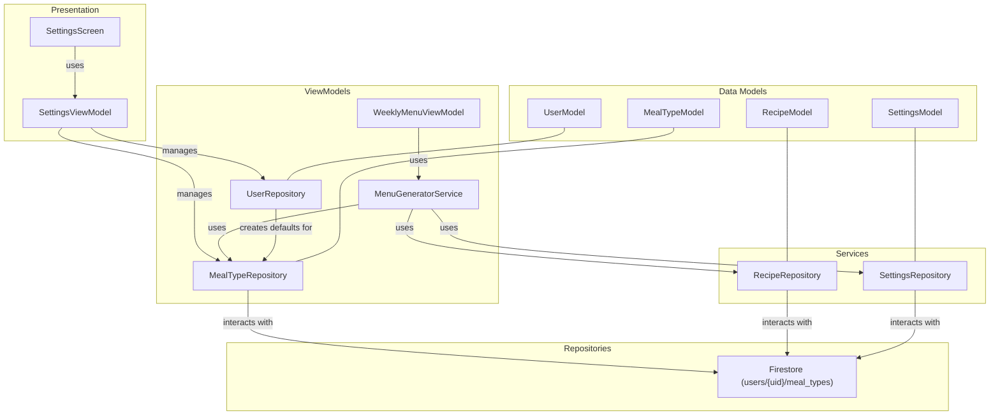

# Meal Type Customization Design Document

## Overview

This document outlines the design for implementing meal type customization in the WeeklyMenu application. Users will be able to add, edit, and delete their own meal types (e.g., "Breakfast", "Lunch", "Dinner", "Snack", "Brunch"), which will then be used throughout the application, including the menu generation feature. The default meal types ("Breakfast", "Lunch", "Dinner") will be automatically provisioned for new users but will be fully modifiable and deletable.

## Detailed Analysis of the Goal

The primary goal is to provide users with full control over the meal types available in their weekly menu planning. This involves:

1.  **User Interface:** Modifying the Settings screen to include a section for managing meal types. This section will feature:
    *   A text input field for entering new meal type names.
    *   An "Add" button to submit the new meal type.
    *   A dynamic list displaying all existing meal types for the user.
    *   A "Delete" button adjacent to each meal type in the list, allowing users to remove them.
2.  **Data Storage:** Changing the storage mechanism for meal types from a `List<String>` within `SettingsModel` to individual documents in a new Firestore subcollection: `users/{uid}/meal_types`. Each document will represent a single meal type.
3.  **Default Provisioning:** When a new user's profile is created, the system will automatically add "Breakfast", "Lunch", and "Dinner" as initial meal types to their `meal_types` subcollection. These defaults will be treated as regular user-defined meal types, meaning they can be deleted by the user.
4.  **Validation:** Enforcing uniqueness for meal type names per user. No other validation (min/max length, characters) is required at this stage.
5.  **Error Handling:** Providing user feedback via toast messages for any errors encountered during adding or deleting meal types, and logging these errors to the console.
6.  **Integration with Menu Generation:** Updating the `MenuGeneratorService` to fetch meal types directly from the new `meal_types` Firestore subcollection rather than from the `SettingsModel`.

## Alternatives Considered

1.  **Keeping `mealTypes` in `SettingsModel` as `List<String>`:**
    *   **Pros:** Simpler to implement initially as it reuses existing `SettingsModel` structure.
    *   **Cons:** Less flexible for individual meal type management (e.g., updating a specific meal type name would require fetching, modifying, and re-saving the entire list). It also makes it harder to store additional metadata per meal type in the future without complex object serialization.
    *   **Decision:** Rejected. The chosen approach of using a subcollection provides more flexibility and scalability for individual meal type management.

2.  **Hardcoding default meal types as undeletable:**
    *   **Pros:** Ensures core meal types are always present.
    *   **Cons:** Limits user customization and could lead to frustration if users want to rename or remove them.
    *   **Decision:** Rejected. The user explicitly requested that all meal types, including defaults, be deletable.

## Detailed Design

### 1. Firestore Structure

A new subcollection `meal_types` will be created under each `user` document:

```
/users/{uid}/
    meal_types/
        {mealTypeId1}/
            name: "Breakfast"
        {mealTypeId2}/
            name: "Lunch"
        {mealTypeId3}/
            name: "Dinner"
        ...
```

The `mealTypeId` will be a Firestore-generated document ID.

### 2. Data Model (`meal_type_model.dart`)

A new model `MealTypeModel` will be created:

```dart
// lib/data/models/meal_type_model.dart
import 'package:cloud_firestore/cloud_firestore.dart';
import 'package:json_annotation/json_annotation.dart';

part 'meal_type_model.g.dart';

@JsonSerializable()
class MealTypeModel {
  @JsonKey(includeFromJson: false, includeToJson: false)
  final String? id; // Firestore document ID

  final String name;

  MealTypeModel({this.id, required this.name});

  factory MealTypeModel.fromFirestore(
    DocumentSnapshot<Map<String, dynamic>> snapshot,
    SnapshotOptions? options,
  ) {
    final data = snapshot.data();
    return MealTypeModel(
      id: snapshot.id,
      name: data?['name'] as String,
    );
  }

  Map<String, dynamic> toFirestore() {
    return {
      'name': name,
    };
  }

  factory MealTypeModel.fromJson(Map<String, dynamic> json) => _$MealTypeModelFromJson(json);
  Map<String, dynamic> toJson() => _$MealTypeModelToJson(this);
}
```

### 3. Repository (`meal_type_repository.dart`)

A new `MealTypeRepository` will be responsible for CRUD operations on `MealTypeModel`s.

```dart
// lib/data/repositories/meal_type_repository.dart
import 'package:cloud_firestore/cloud_firestore.dart';
import '../models/meal_type_model.dart';

class MealTypeRepository {
  final FirebaseFirestore _firestore;
  final String _userId;

  MealTypeRepository(this._firestore, this._userId);

  CollectionReference<MealTypeModel> get _mealTypesRef => _firestore
      .collection('users')
      .doc(_userId)
      .collection('meal_types')
      .withConverter<MealTypeModel>(
        fromFirestore: MealTypeModel.fromFirestore,
        toFirestore: (mealType, _) => mealType.toFirestore(),
      );

  Stream<List<MealTypeModel>> getMealTypes() {
    return _mealTypesRef.snapshots().map((snapshot) {
      return snapshot.docs.map((doc) => doc.data()).toList();
    });
  }

  Future<void> addMealType(MealTypeModel mealType) async {
    // Check for uniqueness before adding
    final existingMealTypes = await _mealTypesRef.where('name', isEqualTo: mealType.name).get();
    if (existingMealTypes.docs.isNotEmpty) {
      throw Exception('Meal type with this name already exists.');
    }
    await _mealTypesRef.add(mealType);
  }

  Future<void> deleteMealType(String mealTypeId) async {
    await _mealTypesRef.doc(mealTypeId).delete();
  }
}
```

### 4. `SettingsModel` Modification

The `mealTypes` field will be removed from `lib/data/models/settings_model.dart`.

```diff
--- a/lib/data/models/settings_model.dart
+++ b/lib/data/models/settings_model.dart
@@ -10,13 +10,10 @@
   @JsonKey(includeFromJson: false, includeToJson: false)
   final String? id;
   final String userId;
-  final List<String> mealTypes;
   final List<String> weekdays;
 
   SettingsModel({
     this.id,
     required this.userId,
-    this.mealTypes = const ['Breakfast', 'Lunch', 'Dinner'],
     this.weekdays = const ['Monday', 'Tuesday', 'Wednesday', 'Thursday', 'Friday', 'Saturday', 'Sunday'],
   });
 
```

### 5. `UserRepository` Modification (for default provisioning)

The `UserRepository` will be updated to provision default meal types when a new user document is created. This will likely involve a new method or modification to an existing `createUser` method.

```dart
// lib/data/repositories/user_repository.dart (conceptual change)
// ... existing code ...
Future<void> createUser(UserModel user) async {
  await _userCollection.doc(user.id).set(user);
  // Provision default meal types
  final mealTypeRepo = MealTypeRepository(_firestore, user.id!);
  await mealTypeRepo.addMealType(MealTypeModel(name: 'Breakfast'));
  await mealTypeRepo.addMealType(MealTypeModel(name: 'Lunch'));
  await mealTypeRepo.addMealType(MealTypeModel(name: 'Dinner'));
}
// ...
```

### 6. `SettingsViewModel` Modification

The `SettingsViewModel` will be updated to manage meal types using the `MealTypeRepository`. It will expose a stream of `List<MealTypeModel>`.

```dart
// lib/presentation/view_models/settings_view_model.dart (conceptual change)
// ... existing imports ...
import '../../data/repositories/meal_type_repository.dart';
import '../../data/models/meal_type_model.dart';
// ...

class SettingsViewModel extends ChangeNotifier {
  // ... existing fields ...
  final MealTypeRepository _mealTypeRepository;

  SettingsViewModel(this._userRepository, this._settingsRepository, this._mealTypeRepository); // Update constructor

  // Stream for meal types
  Stream<List<MealTypeModel>> get mealTypes => _mealTypeRepository.getMealTypes();

  Future<void> addMealType(String name) async {
    try {
      await _mealTypeRepository.addMealType(MealTypeModel(name: name));
      // Show success toast
    } catch (e) {
      // Show error toast, log error
    }
  }

  Future<void> deleteMealType(String id) async {
    try {
      await _mealTypeRepository.deleteMealType(id);
      // Show success toast
    } catch (e) {
      // Show error toast, log error
    }
  }
  // ...
}
```

### 7. Settings Screen UI (`settings_screen.dart`)

The `SettingsScreen` will be updated to consume the `mealTypes` stream from `SettingsViewModel` and provide the UI for adding and deleting meal types.

```dart
// lib/presentation/screens/settings_screen.dart (conceptual UI)
// ...
Consumer<SettingsViewModel>(
  builder: (context, viewModel, child) {
    return Column(
      children: [
        // ... existing settings UI ...
        Text('Manage Meal Types'),
        TextField(
          controller: _mealTypeController,
          decoration: InputDecoration(labelText: 'New Meal Type'),
        ),
        ElevatedButton(
          onPressed: () async {
            await viewModel.addMealType(_mealTypeController.text);
            _mealTypeController.clear();
          },
          child: Text('Add Meal Type'),
        ),
        StreamBuilder<List<MealTypeModel>>(
          stream: viewModel.mealTypes,
          builder: (context, snapshot) {
            if (snapshot.hasData) {
              return ListView.builder(
                shrinkWrap: true,
                itemCount: snapshot.data!.length,
                itemBuilder: (context, index) {
                  final mealType = snapshot.data![index];
                  return ListTile(
                    title: Text(mealType.name),
                    trailing: IconButton(
                      icon: Icon(Icons.delete),
                      onPressed: () => viewModel.deleteMealType(mealType.id!),
                    ),
                  );
                },
              );
            }
            return CircularProgressIndicator();
          },
        ),
      ],
    );
  },
),
// ...
```

### 8. `MenuGeneratorService` Integration

The `MenuGeneratorService` will be updated to take `MealTypeRepository` as a dependency and fetch meal types from it.

```dart
// lib/data/services/menu_generator_service.dart (conceptual change)
// ... existing imports ...
import '../repositories/meal_type_repository.dart';
import '../models/meal_type_model.dart';
// ...

class MenuGeneratorService {
  // ... existing fields ...
  final MealTypeRepository _mealTypeRepository;

  MenuGeneratorService(this._recipeRepository, this._settingsRepository, this._mealTypeRepository); // Update constructor

  Future<List<WeeklyMenuItemModel>> generateMenu(String userId) async {
    // ... existing logic ...

    // Fetch meal types from the repository
    final mealTypes = await _mealTypeRepository.getMealTypes().first; // Get current list
    final mealTypeNames = mealTypes.map((mt) => mt.name).toList();

    // ... use mealTypeNames in menu generation logic ...
  }
}
```

### Diagrams



### Summary

This design introduces a new `MealTypeModel` and `MealTypeRepository` to manage user-defined meal types in a dedicated Firestore subcollection. The `SettingsModel` will be refactored to no longer directly store `mealTypes`. The `UserRepository` will be enhanced to provision default meal types for new users. The `SettingsScreen` will provide the UI for managing these meal types, and the `SettingsViewModel` will orchestrate the UI-repository interaction. Finally, the `MenuGeneratorService` will be updated to fetch meal types from the new repository, ensuring that the menu generation logic uses the user's customized meal types. Error handling will be implemented with toast messages and console logging.

## References

*   [Flutter Firestore integration](https://firebase.google.com/docs/firestore/use-cases/rtdb-to-firestore)
*   [Provider package for state management](https://pub.dev/packages/provider)
*   [json_serializable package](https://pub.dev/packages/json_serializable)
