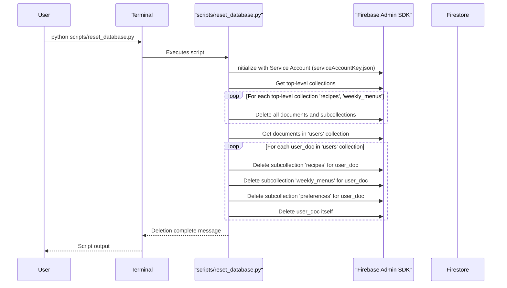

# WeeklyMenu App Modification Design Document

## 1. Overview
This document outlines the design for refactoring the Firestore database structure for recipes and weekly menus. Currently, these collections reside at the top level of the database. The new design proposes nesting them under a user-specific path `/users/{uid}/`. This enhances data security and organization.

Additionally, a Python script named `reset_database.py` will be created in the `scripts` directory. This script's purpose is to facilitate comprehensive database clearing for testing environments, deleting all top-level collections and user-specific subcollections. The Flutter application's logic will be updated to reflect and correctly interact with this new database structure.

## 2. Detailed Analysis of the Goal or Problem

### 2.1. Firestore Database Refactoring
- **Current Structure:** Recipes are stored in a top-level collection `/recipes/{recipeId}`. Weekly menus are in `/weekly_menus/{userId}`. User-specific settings are already nested under `/users/{userId}/preferences/settings`.
- **Desired Structure:**
    - User data: `/users/{uid}` (this top-level collection will remain for user profiles).
    - User-specific settings: `/users/{uid}/preferences/settings` (existing structure).
    - User-specific recipes: `/users/{uid}/recipes/{recipeId}`.
    - User-specific weekly menus: `/users/{uid}/weekly_menus/{weeklyMenuId}`.
- **Problem:** The current top-level storage of recipes and weekly menus does not inherently enforce user data isolation, relying on security rules alone. Nesting them under a user's UID provides a clearer ownership model and simplifies security rule definition. It also means that when a user is deleted, their data can be easily removed.
- **Impact:** This refactoring requires significant changes across data models (to ensure `userId` is consistently available), repositories (to construct new Firestore paths), and potentially view models (to pass `userId` to repository methods).

### 2.2. `reset_database.py` Script
- **Purpose:** To provide a testing utility that can completely wipe the Firestore database to ensure a clean state for integration and development testing.
- **Authentication:** The script will use the Firebase Admin SDK for Python, which requires a service account key for authentication. Instructions for generating and configuring this key will be provided.
- **Deletion Scope:** As requested, the script will implement "Option B," meaning it will:
    - Delete the top-level `/users` collection, and all its subcollections for each user (including `/recipes`, `/weekly_menus`, and `/preferences`).
    - Delete the old top-level `/recipes` and `/weekly_menus` collections to clean up any legacy data.
    This approach ensures a truly blank slate for testing.

## 3. Alternatives Considered

### 3.1. Database Refactoring Approach
- **Option 1 (Migration strategy):** Implement a one-time migration script or logic within the app to move existing user data from the old top-level collections to the new nested structure.
    - *Pros:* Preserves existing user data.
    - *Cons:* Adds complexity to the application, requires careful handling of data integrity during migration.
- **Option 2 (Direct modification - Preferred):** Directly modify the app's code to create and read data according to the new nested structure. Any existing data in the old top-level collections will effectively be orphaned (and will be cleaned up by the `reset_database.py` script for test environments).
    - *Pros:* Simpler implementation for the app itself, less code complexity.
    - *Cons:* Does not handle existing production data migration (assuming this is a development/testing context). This is acceptable given the context of a testing reset script.

### 3.2. Script Authentication
- **Option 1 (Firebase Service Account - Preferred):** Use a Firebase Service Account key. This is the recommended and most secure method for server-side or administrative access to Firebase services.
- **Option 2 (User authentication with Firebase Auth):** Authenticate as a regular user. This is less suitable for administrative tasks like full database resets due to permission requirements and potential security concerns.

## 4. Detailed Design for the Modification

### 4.1. Firestore Database Refactoring (Flutter App)

- **Goal:** Update all relevant repository methods and data flows to interact with the new nested Firestore paths.
- **Target Files:**
    - `lib/data/models/recipe_model.dart`:
        - No structural changes to the model itself. The `userId` field (already present) will be crucial for path construction.
    - `lib/data/models/weekly_menu_model.dart`:
        - No structural changes to the model itself. The `id` field (which corresponds to `userId`) will be crucial for path construction.
    - `lib/data/repositories/recipe_repository.dart`:
        - **`createRecipe(RecipeModel recipe)`:** Path will change from `collection('recipes').doc(recipe.id)` to `collection('users').doc(recipe.userId).collection('recipes').doc(recipe.id)`.
        - **`getRecipe(String userId, String recipeId)`:** (Method signature change required) The method will need `userId` as a parameter. Path will change from `collection('recipes').doc(recipeId)` to `collection('users').doc(userId).collection('recipes').doc(recipeId)`.
        - **`getRecipesForUser(String userId)`:** Path will change from `collection('recipes').where('user_id', isEqualTo: userId)` to `collection('users').doc(userId).collection('recipes')`. The `where` clause becomes unnecessary.
        - **`updateRecipe(RecipeModel recipe)`:** Path will change from `collection('recipes').doc(recipe.id)` to `collection('users').doc(recipe.userId).collection('recipes').doc(recipe.id)`.
        - **`deleteRecipe(String userId, String recipeId)`:** (Method signature change required) The method will need `userId` as a parameter. Path will change from `collection('recipes').doc(recipeId)` to `collection('users').doc(userId).collection('recipes').doc(recipeId)`.
    - `lib/data/repositories/weekly_menu_repository.dart`:
        - **`createOrUpdateWeeklyMenu(WeeklyMenuModel weeklyMenu)`:** Path will change from `collection('weekly_menus').doc(weeklyMenu.id)` to `collection('users').doc(weeklyMenu.id!).collection('weekly_menus').doc('current_menu')`. (Assuming `weeklyMenu.id` is the user's ID, and there's one "current_menu" per user).
        - **`getWeeklyMenu(String userId)`:** Path will change from `collection('weekly_menus').doc(userId)` to `collection('users').doc(userId).collection('weekly_menus').doc('current_menu')`.
        - **`streamWeeklyMenu(String userId)`:** Path will change from `collection('weekly_menus').doc(userId).snapshots()` to `collection('users').doc(userId).collection('weekly_menus').doc('current_menu').snapshots()`.
        - **`deleteWeeklyMenu(String userId)`:** Path will change from `collection('weekly_menus').doc(userId)` to `collection('users').doc(userId).collection('weekly_menus').doc('current_menu')`.
    - `lib/presentation/view_models/cookbook_view_model.dart`:
        - Adjust calls to `RecipeRepository` methods (`createRecipe`, `getRecipesForUser`, `updateRecipe`, `deleteRecipe`) to pass the current `userId` (obtained from `AuthRepository`).
    - `lib/presentation/view_models/weekly_menu_view_model.dart`:
        - Adjust calls to `WeeklyMenuRepository` methods (`createOrUpdateWeeklyMenu`, `streamWeeklyMenu`) to pass the current `userId` (obtained from `AuthRepository` or `_currentSettings.id`).
    - `lib/presentation/view_models/shopping_list_view_model.dart`:
        - Adjust calls to `RecipeRepository` and `ShoppingListRepository` methods to pass `userId` where newly required.
    - `integration_test/weekly_menu_generation_test.dart`:
        - Adjust `setUpAll` and `tearDownAll` calls to `RecipeRepository.deleteRecipe` and `RecipeRepository.createRecipe` to include `userId` as a parameter.

### 4.2. `reset_database.py` Script Design

- **Goal:** Create a Python script to comprehensively clear Firestore data for testing purposes.
- **Location:** `scripts/reset_database.py`
- **Instructions (for `scripts/README.md`):**
    1.  **Install Firebase Admin SDK:** `pip install firebase-admin`
    2.  **Service Account Key:**
        - Go to Firebase Console -> Project settings -> Service accounts.
        - Generate a new private key. This will download a JSON file.
        - Place this JSON file in the `scripts/` directory (e.g., `serviceAccountKey.json`).
        - *Warning:* Keep this file secure and do not commit it to public repositories.
    3.  **Usage:** `python scripts/reset_database.py`
- **Functionality (within `scripts/reset_database.py`):**
    1.  **Import necessary libraries:** `firebase_admin`, `credentials`, `firestore`.
    2.  **Initialize App:** `firebase_admin.initialize_app(credentials.Certificate('serviceAccountKey.json'))`
    3.  **Get Firestore client:** `db = firestore.client()`
    4.  **Delete top-level `/recipes` and `/weekly_menus` collections:** Iterate through documents in these collections and delete them in batches.
    5.  **Delete `/users` collection and its subcollections:**
        - Get all user documents from the `/users` collection.
        - For each user document:
            - Get a reference to its `/recipes` subcollection. Delete all documents within it.
            - Get a reference to its `/weekly_menus` subcollection. Delete all documents within it.
            - Get a reference to its `/preferences` subcollection. Delete all documents within it.
            - Delete the user document itself.
    6.  Implement a recursive delete function for subcollections, as Firestore's `delete()` method for documents only deletes the document, not its subcollections.

## 5. Diagrams

### 5.1. Firestore Data Structure Change

```mermaid
graph TD
    subgraph Old Structure
        A[Firestore Root] --> B[Collection: /recipes]
        A --> C[Collection: /weekly_menus]
        A --> D[Collection: /users]
        D --> D1[Document: /users/{uid}]
        D1 --> D2[Collection: /users/{uid}/preferences]
        D2 --> D3[Document: /users/{uid}/preferences/settings]
    end

    subgraph New Structure
        X[Firestore Root] --> Y[Collection: /users]
        Y --> Y1[Document: /users/{uid}]
        Y1 --> Y2[Collection: /users/{uid}/preferences]
        Y2 --> Y3[Document: /users/{uid}/preferences/settings]
        Y1 --> Y4[Collection: /users/{uid}/recipes]
        Y4 --> Y5[Document: /users/{uid}/recipes/{recipeId}]
        Y1 --> Y6[Collection: /users/{uid}/weekly_menus]
        Y6 --> Y7[Document: /users/{uid}/weekly_menus/{weeklyMenuId}]
    end

    Old Structure -- Refactor --> New Structure
```

### 5.2. `reset_database.py` Execution Flow



## 6. Summary of the Design

This design outlines a comprehensive refactoring of the Firestore database, nesting user-specific recipes and weekly menus under `/users/{uid}/`. This change improves data security, organization, and simplifies user data management upon account deletion. The app's `RecipeRepository`, `WeeklyMenuRepository`, and associated ViewModels will be updated to interact with these new paths.

A Python script `reset_database.py` will be developed, utilizing the Firebase Admin SDK, to enable complete clearing of the Firestore database for testing purposes. This includes deleting all top-level `recipes` and `weekly_menus` collections, as well as all user documents and their subcollections within `/users`. Instructions for setting up the Firebase Admin SDK for the script will be included in `scripts/README.md`.

## 7. References to Research URLs
- [Firebase Admin SDK for Python: Firestore](https://firebase.google.com/docs/admin/setup)
- [Firestore Data Model](https://firebase.google.com/docs/firestore/data-model)
- [Firestore Security Rules](https://firebase.google.com/docs/firestore/security/overview)
- [Python Firebase Admin SDK: Deleting data](https://firebase.google.com/docs/firestore/manage-data/delete-data)
- [Firestore: Delete collections](https://firebase.google.com/docs/firestore/manage-data/delete-data#delete_collections) (Important for recursive delete)