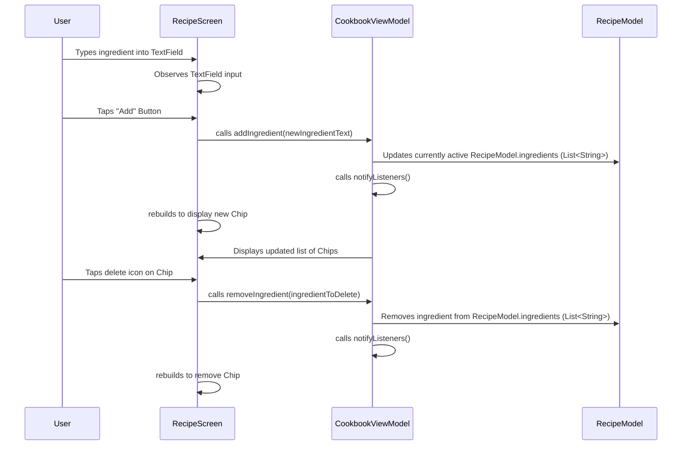
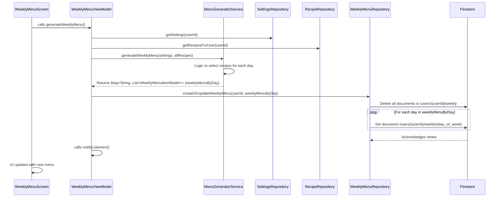

# WeeklyMenu App Modification Design Document

## 1. Overview
This document outlines the design for a significant refactoring of the Firestore database structure within the WeeklyMenu application. The primary goal is to improve data organization, security, and flexibility by nesting user-specific data under a more granular path. Recipes will be moved from `users/{uid}/recipes/{recipeId}` to `users/{uid}/cookbook/{recipe_uid}`, and their ingredients will be stored as a `List<String>`. The weekly menu will transition from a single document (`users/{uid}/weekly_menus/current_menu`) to a subcollection `users/{uid}/weekly/`, where each document represents a day's menu (e.g., `users/{uid}/weekly/monday`).

Correspondingly, the application's logic (data models, repositories, services, view models) will be updated to reflect these new paths and data structures. The UI for ingredient input in the `RecipeScreen` will be redesigned to support `List<String>` ingredients using a chip-based display with an "add" button. Finally, the `reset_database.py` script will be modified to handle the new collection names.

## 2. Detailed Analysis of the Goal or Problem

### 2.1. Firestore Database Refactoring
- **Current Structure:**
    - Recipes: `users/{uid}/recipes/{recipeId}`. Ingredients within `RecipeModel` are currently a `List<String>`. (Although previous UI might have assumed a comma-separated string).
    - Weekly Menu: `users/{uid}/weekly_menus/current_menu` (a single document `current_menu` stores the entire week's menu as a `Map<String, List<WeeklyMenuItemModel>>`).
- **Desired Structure:**
    - **Recipes:** `users/{uid}/cookbook/{recipe_uid}`. This maintains user ownership and provides a more descriptive collection name. The `ingredients` field within each `recipe_uid` document will explicitly store a `List<String>`.
    - **Weekly Menu:** `users/{uid}/weekly/{day_of_week}`. Here, `weekly` is a subcollection under the user's UID. Each document in this subcollection (e.g., `monday`, `tuesday`, `wednesday`, `thursday`, `friday`, `saturday`, `sunday`) will represent the menu for that specific day. Each `day_of_week` document will contain a `List<WeeklyMenuItemModel>` for the meals scheduled on that day.
- **Problem:** The change in structure for recipes (collection name) and weekly menus (single document to per-day documents) necessitates a complete overhaul of how these entities are stored and retrieved. The current `WeeklyMenuModel` structure (Map of days to lists of menu items) is suitable for in-memory representation but needs adaptation for per-day document persistence.
- **Impact:** This refactoring is extensive, requiring modifications across:
    - **Data Models:** `RecipeModel` (verify `ingredients` as `List<String>`), `WeeklyMenuModel` (adapt for per-day storage/retrieval).
    - **Repositories:** `RecipeRepository`, `WeeklyMenuRepository`.
    - **Services:** `MenuGeneratorService`, `ShoppingListService`.
    - **View Models:** `CookbookViewModel`, `WeeklyMenuViewModel`, `ShoppingListViewModel`.
    - **UI:** `RecipeScreen`.
    - **Integration Tests:** All tests interacting with recipes or weekly menus.
    - **Utility Scripts:** `reset_database.py`.

### 2.2. UI for Ingredients in `RecipeScreen`
- **Current UI:** A single `TextField` where users are expected to input comma-separated ingredients.
- **Desired UI:**
    - Display: Existing ingredients will be shown as a series of `Chip` widgets within a `Wrap` layout.
    - Interaction: A dedicated input mechanism (e.g., a `TextField` with a clear button) for entering a *single* new ingredient, followed by an "Add" button to append it to the list of ingredients.
- **Problem:** The current UI does not inherently support `List<String>` input/display in an intuitive way as specified.
- **Impact:** `RecipeScreen` will require significant changes to its layout and state management to handle the new ingredient input/display paradigm.

## 3. Alternatives Considered

### 3.1. Weekly Menu Storage
- **Option 1 (Single Document per Week - Preferred by user intent):** Store the entire week's menu as a single document under `users/{uid}/weekly/current_menu`.
    - *Pros:* Simple to read/write the entire menu at once. Aligns with "only the most recent weekly menu is saved".
    - *Cons:* If only one day's meal changes, the entire document is rewritten. Max document size could be an issue for very large menus (unlikely here).
- **Option 2 (Per-Day Documents - Preferred by user explicit instruction):** Store each day of the week as a separate document under `users/{uid}/weekly/{day_of_week}`.
    - *Pros:* Granular updates, easier to query for a specific day.
    - *Cons:* Requires more complex read/write logic to assemble the full weekly view. Deleting the "previous one" means deleting all 7 day documents.
    - *Decision:* The user's instruction "under `user/{uid}/weekly`, there should be `monday` with a list of recipes for lunch, dinner, etc" explicitly states Option 2. I will implement this approach.

### 3.2. UI for Ingredients
- **Option 1 (Dynamic TextFields):** Display a list of editable `TextField` widgets, one for each ingredient, with add/remove buttons.
    - *Pros:* Direct editing of individual ingredients.
    - *Cons:* More complex UI state management (managing focus, adding/removing text controllers). Can be visually cluttered for many ingredients.
- **Option 2 (Chips with single input - Preferred):** A single `TextField` for adding one ingredient at a time, and displaying existing ingredients as `Chip` widgets.
    - *Pros:* Clean UI, clear interaction model for adding/removing.
    - *Cons:* Editing an existing ingredient requires a multi-step process (remove, then add new).
    - *Decision:* User explicitly requested "rows of chips with each chip being a ingredient, and user should tap on a add button to add a single ingredient to the list." I will implement this.

## 4. Detailed Design for the Modification

### 4.1. `RecipeModel` and `RecipeRepository` Refactoring

- **Targets:** `lib/data/models/recipe_model.dart`, `lib/data/repositories/recipe_repository.dart`.
- **Changes:**
    1.  **`RecipeModel`**:
        -   Verify `ingredients` field is `List<String>`. (Already is).
        -   No change to `toJson()`/`fromJson()` for ingredients as `json_serializable` handles `List<String>` natively.
    2.  **`RecipeRepository`**:
        -   **Collection Path Adjustment:** All Firestore access paths for recipes will change from `collection('users').doc(userId).collection('recipes')` to `collection('users').doc(userId).collection('cookbook')`.
        -   **`createRecipe(RecipeModel recipe)`:** Path will be `collection('users').doc(recipe.userId).collection('cookbook').doc(recipe.id)`.
        -   **`getRecipe(String userId, String recipeId)`:** Path will be `collection('users').doc(userId).collection('cookbook').doc(recipeId)`.
        -   **`getRecipesForUser(String userId)`:** Path will be `collection('users').doc(userId).collection('cookbook')`.
        -   **`updateRecipe(RecipeModel recipe)`:** Path will be `collection('users').doc(recipe.userId).collection('cookbook').doc(recipe.id)`.
        -   **`deleteRecipe(String userId, String recipeId)`:** Path will be `collection('users').doc(userId).collection('cookbook').doc(recipeId)`.

### 4.2. `WeeklyMenuModel` and `WeeklyMenuRepository` Refactoring

- **Targets:** `lib/data/models/weekly_menu_model.dart`, `lib/data/repositories/weekly_menu_repository.dart`.
- **Changes:**
    1.  **`WeeklyMenuModel`**:
        -   This model will no longer be directly persisted as a single Firestore document. Instead, its properties will be derived from the per-day documents.
        -   The `id` property (which was the `userId`) will still identify the menu. The `menuItems` (Map<String, List<WeeklyMenuItemModel>>) will be populated by fetching individual day documents.
        -   The `toJson()` method will become responsible for preparing the data to be saved as individual day documents (i.e., mapping the overall `menuItems` map into individual day's data).
        -   The `fromJson()` factory will need to be adapted if `WeeklyMenuModel` objects are created from the collection of day documents.
        - *Correction:* Given "only the most recent weekly menu is saved" and "previous one will be replaced", it's simpler to make `WeeklyMenuModel` primarily an *in-memory representation*. The repository will handle the conversion between this in-memory model and the per-day Firestore documents.
    2.  **`WeeklyMenuRepository`**:
        - **`createOrUpdateWeeklyMenu(String userId, Map<String, List<WeeklyMenuItemModel>> weeklyMenuByDay)`:** This method will now be responsible for:
            1.  Deleting all existing documents under `users/{userId}/weekly` subcollection to replace the previous menu.
            2.  For each day in `weeklyMenuByDay`, create a new document `users/{userId}/weekly/{day_of_week}` (e.g., `users/{userId}/weekly/monday`).
            3.  Each day document will store a `List<WeeklyMenuItemModel>` (which needs to be serialized into a list of maps using `toJson()` for each `WeeklyMenuItemModel`).
        - **`getWeeklyMenu(String userId)`:** This method will fetch all documents from `users/{userId}/weekly` subcollection, deserialize each into a `List<WeeklyMenuItemModel>`, and reassemble them into a `Map<String, List<WeeklyMenuItemModel>>`.
        - **`streamWeeklyMenu(String userId)`:** This method will listen to changes in all documents within the `users/{userId}/weekly` subcollection, reassembling the `Map<String, List<WeeklyMenuItemModel>>` on each update.
        - **`deleteWeeklyMenu(String userId)`:** Delete all documents in `users/{userId}/weekly`.
        - *Helper Function:* Implement a helper `_weeklyMenuItemListToJson(List<WeeklyMenuItemModel> items)` for serialization and `_jsonToWeeklyMenuItemList(List<dynamic> jsonList)` for deserialization within the repository.

### 4.3. UI for Ingredients (`RecipeScreen`)

- **Target:** `lib/presentation/screens/recipe_screen.dart`.
- **Targets for state management:** `lib/presentation/view_models/cookbook_view_model.dart` (specifically for the recipe being edited/added).
- **Changes:**
    1.  **`RecipeScreen`**:
        -   Remove the old `TextField` for ingredients.
        -   Introduce a `TextEditingController` for a new single ingredient input `TextField`.
        -   Add an `ElevatedButton` or `IconButton` with an "Add" label/icon.
        -   Display current ingredients as `Chip` widgets within a `Wrap` layout. Each `Chip` should have a `deleteIcon` or be tappable to remove.
        -   The `ingredients` list displayed will come from the `CookbookViewModel`'s currently active recipe.
    2.  **`CookbookViewModel`**:
        -   Add methods `addIngredient(String ingredient)` and `removeIngredient(String ingredient)` to modify the `ingredients` list of the currently selected/edited `RecipeModel`. These methods should then trigger `notifyListeners()` and potentially save the recipe. (Saving will be handled by `updateRecipe` when the main recipe form is saved).

### 4.4. `reset_database.py` Script Updates

- **Target:** `scripts/reset_database.py`.
- **Changes:**
    - Update the deletion logic for user-specific subcollections:
        - Change path for recipes from `users_ref.document(user_id).collection('recipes')` to `users_ref.document(user_id).collection('cookbook')`.
        - Change path for weekly menus from `users_ref.document(user_id).collection('weekly_menus')` to `users_ref.document(user_id).collection('weekly')`.

## 5. Diagrams

### 5.1. Firestore Data Structure (New)

```mermaid
graph TD
    A[Firestore Root] --> B[Collection: /users]
    B --> C[Document: /users/{uid}]
    C --> D[Collection: /users/{uid}/preferences]
    D --> D1[Document: /users/{uid}/preferences/settings]

    C --> E[Collection: /users/{uid}/cookbook]
    E --> E1[Document: /users/{uid}/cookbook/{recipe_uid}]
    E1 -- Field: name --> E1F1[String]
    E1 -- Field: ingredients --> E1F2[List<String>]
    E1 -- Field: categories --> E1F3[List<String>]
    E1 -- etc. --> E1F4[...]

    C --> F[Collection: /users/{uid}/weekly]
    F --> F1[Document: /users/{uid}/weekly/monday]
    F1 -- Field: menuItems (list) --> F1F1[List<WeeklyMenuItemModel>]
    F --> F2[Document: /users/{uid}/weekly/tuesday]
    F2 -- Field: menuItems (list) --> F2F1[List<WeeklyMenuItemModel>]
    F --> F3[...]
```

### 5.2. Ingredients UI Flow in `RecipeScreen`



### 5.3. Weekly Menu Generation Flow (Refactored)



## 6. Summary of the Design

This design outlines a substantial refactoring effort to align the Firestore database structure with an improved data ownership model and to enhance the ingredient input UI. Recipes will be stored under `users/{uid}/cookbook/{recipe_uid}`, and the weekly menu will be split into per-day documents under `users/{uid}/weekly/{day_of_week}`. The `RecipeModel`'s `ingredients` will be explicitly handled as `List<String>`. The `RecipeScreen` will feature a new chip-based UI for managing ingredients, allowing single-ingredient additions via a text field and button.

Core application logic across `RecipeRepository`, `WeeklyMenuRepository`, `CookbookViewModel`, `WeeklyMenuViewModel`, `MenuGeneratorService`, `ShoppingListViewModel`, and relevant integration tests will be updated to seamlessly interact with these new paths and data structures. Finally, the `reset_database.py` script will be modified to ensure it correctly cleans up these new collection names, providing a robust testing environment.

## 7. References to Research URLs
- [Firestore Data Model: Subcollections](https://firebase.google.com/docs/firestore/data-model#subcollections)
- [Flutter Chips (Wrap widget)](https://api.flutter.dev/flutter/material/Chip-class.html)
- [Flutter TextFields](https://api.flutter.dev/flutter/material/TextField-class.html)
- [Flutter Provider package](https://pub.dev/packages/provider)
- [Firebase Admin SDK for Python: Deleting data](https://firebase.google.com/docs/firestore/manage-data/delete-data)
- [Firestore: Delete collections](https://firebase.google.com/docs/firestore/manage-data/delete-data#delete_collections)