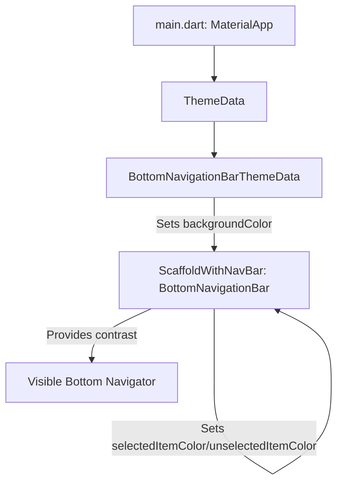
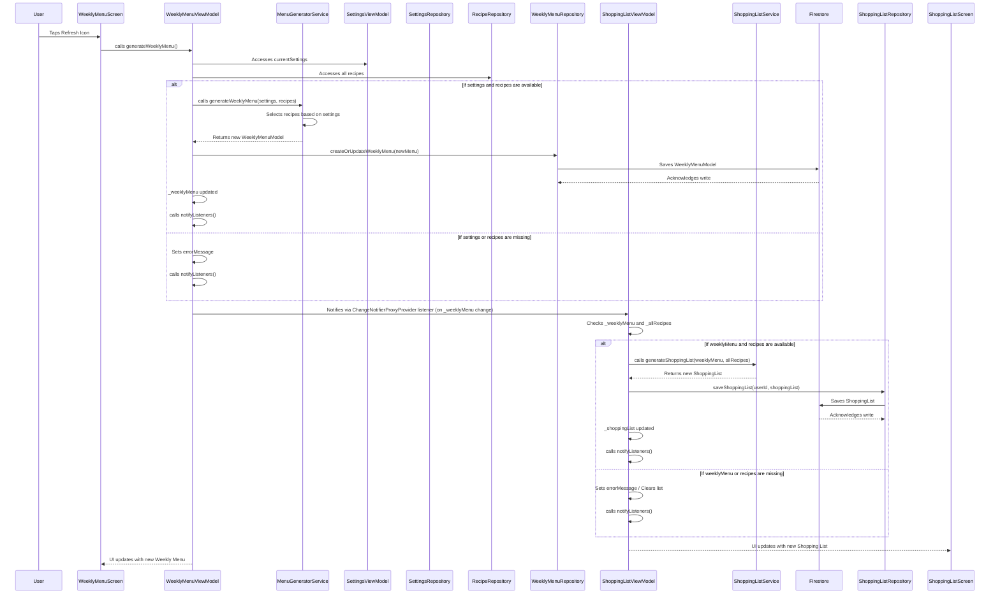

# WeeklyMenu App Modification Design Document

## 1. Overview
This document outlines the design for addressing three identified problems in the WeeklyMenu application: an invisible bottom navigation bar, a non-functional weekly menu refresh mechanism, and a consequently broken shopping list generation. The primary goal is to enhance the application's usability and core functionality by making the bottom navigation clearly visible, enabling users to generate weekly menus effectively, and ensuring the shopping list is updated automatically based on the generated menu.

## 2. Detailed Analysis of the Goal or Problem

### 2.1. Invisible Bottom Navigator
- **Problem:** The `BottomNavigationBar` at the bottom of the `ScaffoldWithNavBar` is currently not visible because its background color is identical or too similar to the surrounding background color, leading to a poor user experience.
- **Analysis:** This is a UI/theming issue. The application's `ThemeData` or the specific `BottomNavigationBar` configuration within `ScaffoldWithNavBar` needs adjustment to provide sufficient contrast between the navigation bar and the main screen content.

### 2.2. Non-functional Weekly Menu Refresh
- **Problem:** Tapping the refresh icon on the `WeeklyMenuScreen` does not generate any new menu items, or at least does not update the displayed list.
- **Analysis:** This problem points to a failure in the menu generation process. The `WeeklyMenuScreen`'s refresh button triggers `WeeklyMenuViewModel.generateWeeklyMenu()`. This method, in turn, calls `MenuGeneratorService.generateWeeklyMenu()`. The failure could be due to several reasons:
    - **`WeeklyMenuViewModel` logic:** `generateWeeklyMenu()` might not be correctly receiving or handling user settings (`_currentSettings`) or available recipes (`_allUserRecipes`), or it might not be properly updating its internal `_weeklyMenu` state and calling `notifyListeners()`.
    - **`MenuGeneratorService` logic:** `generateWeeklyMenu()` might be returning an empty or incorrect `WeeklyMenuModel` if there are issues with recipe selection, filtering based on settings, or if it encounters `null` or empty lists for meal types/weekdays.
    - **Data availability:** User settings (`SettingsModel`) or recipes might not be correctly loaded or available to the `WeeklyMenuViewModel` or `MenuGeneratorService`.

### 2.3. Broken Shopping List Generation
- **Problem:** The shopping list is not generated or updated after the weekly menu fix.
- **Analysis:** The `ShoppingListViewModel` is designed to listen for changes in the `WeeklyMenuViewModel` and trigger its own `_generateAndSaveShoppingList()` method. If the `WeeklyMenuViewModel` fails to generate or update the weekly menu, the `ShoppingListViewModel` will not be notified of any changes, and thus, the shopping list will not be generated. This issue is a direct consequence of the non-functional weekly menu refresh.

## 3. Alternatives Considered

### 3.1. Bottom Navigator Color Solutions
- **Option 1 (Theme-based - Preferred):** Modify the application's global `ThemeData` to define a `BottomNavigationBarThemeData`. This approach ensures consistency across the app and is the idiomatic way to handle theming in Flutter. We can select a `backgroundColor` and `selectedItemColor`/`unselectedItemColor` that provide good contrast.
- **Option 2 (Hardcoded Color):** Manually set `backgroundColor` directly on the `BottomNavigationBar` widget in `ScaffoldWithNavBar`. While quick, this bypasses the theme system and can lead to inconsistencies if not managed carefully.

### 3.2. Weekly Menu Generation Fixes
- **Option 1 (Debug and Refactor - Preferred):** Systematically debug the `generateWeeklyMenu` method across `WeeklyMenuViewModel` and `MenuGeneratorService`. This involves verifying the flow of `SettingsModel` and `RecipeModel` data, the recipe selection logic, and ensuring `notifyListeners()` is called correctly. This targets the root cause directly.
- **Option 2 (Bypass/Temporary Solution):** Implement a simplified menu generation that ignores settings or recipes to just show *something*. This is not a viable long-term solution as it doesn't fix the underlying problem and reduces functionality.

## 4. Detailed Design for the Modification

### 4.1. Fixing the Invisible Bottom Navigator

- **Approach:** Enhance the app's `ThemeData` to apply a distinct color scheme to the `BottomNavigationBar`.
- **Target File:** `lib/main.dart` (where `ThemeData` is configured).
- **Changes:**
    - Locate the existing `ThemeData` definition (likely for `lightTheme` and `darkTheme`).
    - Add or modify the `bottomNavigationBarTheme` property within `ThemeData`.
    - For the `lightTheme`, set a `backgroundColor` that provides clear contrast with the default `Scaffold` background. A subtle, slightly darker gray or a primary color from the existing palette could work. Ensure `selectedItemColor` and `unselectedItemColor` are also set for visibility.
    - For the `darkTheme`, ensure the `BottomNavigationBar` is also clearly visible, perhaps with a lighter background and contrasting icons/labels.
- **Rationale:** Using the theme system is the most robust way to ensure UI consistency and manage colors across different themes (light/dark mode).

### 4.2. Fixing the Non-functional Weekly Menu Refresh

- **Approach:** Inspect and correct the menu generation logic and data flow.
- **Target Files:**
    - `lib/presentation/view_models/weekly_menu_view_model.dart`
    - `lib/data/services/menu_generator_service.dart`
    - `lib/data/repositories/weekly_menu_repository.dart`
- **Changes:**
    1.  **`WeeklyMenuViewModel`**:
        -   Verify that `_generateAndSaveMenuIfNeeded()` is correctly invoked and its conditional logic (`if (_currentSettings != null && _allUserRecipes.isNotEmpty)`) is met when expected.
        -   Ensure that `generateWeeklyMenu()` method properly calls `_menuGeneratorService.generateWeeklyMenu()` with valid `SettingsModel` and `List<RecipeModel>`.
        -   Confirm that `_weeklyMenuRepository.createOrUpdateWeeklyMenu()` is called with the generated `WeeklyMenuModel`.
        -   Crucially, investigate why `_currentSettings` or `_allUserRecipes` might be null or empty if they should not be. Add logging to confirm values.
    2.  **`MenuGeneratorService`**:
        -   Review `generateWeeklyMenu()` method. Ensure the filtering of recipes (`suitableRecipes`) based on `userSettings.includedMeals` and the random selection logic are sound.
        -   Specifically, check if `suitableRecipes` is ever empty, leading to no menu items. This might happen if `recipe.categories` are not correctly matching `mealType`.
        -   Verify that `userSettings.includedWeekdays` and `userSettings.includedMeals` (from `SettingsModel`) are always populated with default values if not explicitly set by the user, or gracefully handled if empty (e.g., generate an empty menu rather than crashing).
    3.  **`WeeklyMenuRepository`**:
        -   Ensure `createOrUpdateWeeklyMenu` correctly saves the `WeeklyMenuModel` to Firestore.

- **Debugging Focus:** Add temporary `print` statements in `WeeklyMenuViewModel.generateWeeklyMenu()` and `MenuGeneratorService.generateWeeklyMenu()` to inspect the values of `_currentSettings`, `_allUserRecipes`, `suitableRecipes`, and the generated menu items at various stages.

### 4.3. Ensuring Shopping List Generation

- **Approach:** Verify the existing reactive mechanism.
- **Target File:** `lib/presentation/view_models/shopping_list_view_model.dart`
- **Changes:**
    - The `ShoppingListViewModel` already listens to changes in `WeeklyMenuViewModel` through a `ChangeNotifierProxyProvider`. Once `WeeklyMenuViewModel` successfully generates and updates its `_weeklyMenu`, `ShoppingListViewModel`'s `_generateAndSaveShoppingList()` should be triggered.
    - No direct code changes are anticipated in `ShoppingListViewModel` initially, but its behavior will be observed to confirm automatic generation.

## 5. Diagrams

### 5.1. Bottom Navigation Bar Theming

### 5.2. Weekly Menu and Shopping List Generation Flow

## 6. Summary of the Design

The design addresses the invisible bottom navigation bar by modifying the app's `ThemeData` to apply a contrasting background and appropriate item colors to the `BottomNavigationBar`. The non-functional weekly menu refresh will be fixed by debugging the `generateWeeklyMenu` logic within `WeeklyMenuViewModel` and `MenuGeneratorService`, focusing on ensuring correct data (user settings, recipes) flow and proper menu generation. The shopping list generation, which is dependent on the weekly menu, will be verified to work automatically once the menu generation is fixed. No new unit or integration tests will be added during this modification, as explicitly requested by the user.

## 7. References to Research URLs
- [Flutter Theming: BottomNavigationBarThemeData](https://api.flutter.dev/flutter/material/BottomNavigationBarThemeData-class.html)
- [Flutter Theme overview](https://flutter.dev/docs/cookbook/design/themes)
- [Flutter Provider package](https://pub.dev/packages/provider)
- [Flutter GoRouter package](https://pub.dev/packages/go_router)
- [Firebase Firestore documentation](https://firebase.google.com/docs/firestore)