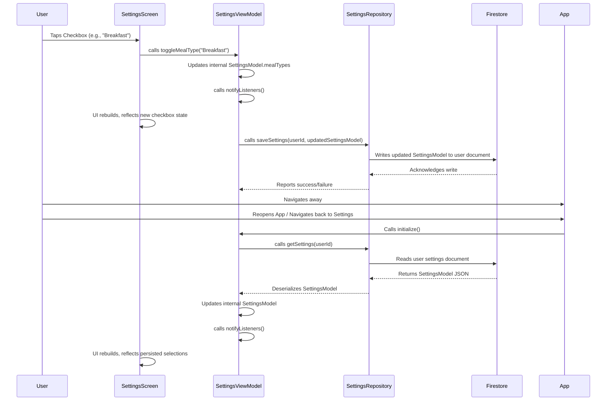

# WeeklyMenu App Modification Design Document

## 1. Overview

This document outlines the design for addressing a reported bug in the WeeklyMenu app where user selections for meal types and weekdays within the settings screen are not being correctly applied or persisted. The goal is to identify the root cause of this data non-persistence and implement a robust solution, ensuring that user preferences for weekly menu generation are accurately saved and loaded.

## 2. Detailed Analysis of the Goal or Problem

### Problem Description
Users are experiencing an issue where, upon interacting with the `CheckboxListTile` widgets for selecting meal types (e.g., breakfast, lunch) and weekdays (e.g., Monday, Tuesday) on the settings screen, the UI does not visually reflect the selection (e.g., the checkbox state or color does not change). Furthermore, these selections are not persisted; if the user navigates away from the settings screen or attempts to generate a weekly menu, the previously attempted selections are not considered, indicating a failure in saving the preferences.

### Current Behavior
1.  User taps on a `CheckboxListTile` for a meal type or weekday in `SettingsScreen`.
2.  The visual state of the `CheckboxListTile` does not update (e.g., the checkbox remains unchecked visually).
3.  Upon exiting and re-entering the `SettingsScreen`, the selections are reset to their previous state.
4.  When attempting to generate a weekly menu, the system does not utilize the user's intended meal type and weekday selections, verifying that the changes were not saved.

### Potential Areas of Failure
The issue could stem from several layers of the application's architecture:
*   **UI Layer (`settings_screen.dart`):**
    *   The `onChanged` callback of the `CheckboxListTile` might not be firing correctly or might not be triggering a UI rebuild.
    *   The UI might not be correctly observing changes from the `SettingsViewModel`.
*   **Presentation Layer (`settings_view_model.dart`):**
    *   The `toggleMealType` or `toggleWeekday` methods might not be correctly updating the internal `SettingsModel` state.
    *   The `saveSettings` method within the `SettingsViewModel` might not be called, or it might not be propagating the updated `SettingsModel` to the `SettingsRepository`.
*   **Data Layer (`settings_repository.dart`):**
    *   The `saveSettings` method in the `SettingsRepository` might be failing to write the updated `SettingsModel` to Firestore.
    *   Errors in Firestore interaction (permissions, data format, network issues) could prevent persistence.
    *   The `getSettings` method might be failing to correctly retrieve the `SettingsModel` from Firestore, or the retrieved data might be outdated/incorrect.
*   **Data Model (`settings_model.dart`):**
    *   Issues with `json_serializable` in the `SettingsModel` for `mealTypes` (List<String>) or `weekdays` (List<String>) during serialization (`toJson`) or deserialization (`fromJson`), leading to data corruption or loss during persistence.

## 3. Alternatives Considered

*   **Direct UI Debugging:** Manually inspecting the widget tree and `SettingsViewModel` state using Flutter DevTools during runtime. While useful for initial diagnosis, it doesn't provide an automated way to reproduce and verify fixes.
*   **Unit Testing Individual Components:** Creating isolated unit tests for `SettingsViewModel` and `SettingsRepository`. This is good practice but might miss integration issues between layers.
*   **Integration Testing:** Developing an end-to-end integration test that simulates user interaction with the settings screen and then verifies the persistence of those settings in the backend (Firestore). This approach is highly effective for identifying issues in the entire data flow from UI to persistence and back, making it the preferred initial strategy.

## 4. Detailed Design for the Modification

The core of the modification will involve a systematic approach to debugging and fixing the persistence issue, starting with an integration test to establish a reproducible failure.

### 4.1. Root Cause Analysis Strategy

1.  **Integration Test Setup:**
    *   Create a new integration test file (`integration_test/settings_persistence_test.dart`).
    *   The test will:
        *   Log in a test user.
        *   Navigate to the `SettingsScreen`.
        *   Simulate tapping on a meal type and a weekday `CheckboxListTile` using `tester.tap()` and `tester.pumpAndSettle()`.
        *   Verify the UI updates visually immediately after tapping.
        *   Navigate away from the `SettingsScreen` and then back to it.
        *   Verify that the selected meal type and weekday are still selected (persisted) in the UI.
        *   Optionally, attempt to generate a weekly menu and assert that the selected preferences are reflected in the generated menu (though this might be deferred if the UI persistence fix resolves the core problem).
2.  **Debugging during Integration Test/Manual Testing:**
    *   Utilize Flutter DevTools to observe the state of `SettingsViewModel` before and after interactions.
    *   Monitor network requests to Firestore to ensure `saveSettings` calls are made and are successful (checking request/response bodies for correct `SettingsModel` data).
3.  **Code Review and Inspection:**
    *   **`settings_screen.dart`**: Ensure `CheckboxListTile`'s `value` property is correctly bound to `SettingsViewModel` state and `onChanged` callback correctly invokes `SettingsViewModel.toggleMealType` or `SettingsViewModel.toggleWeekday`.
    *   **`settings_view_model.dart`**: Verify that `toggleMealType` and `toggleWeekday` methods correctly modify the `_settings` object (a `SettingsModel` instance) and that `_settingsRepository.saveSettings` is consistently called after any modification. Pay attention to `notifyListeners()` calls.
    *   **`settings_repository.dart`**: Inspect `saveSettings` for proper Firestore document updates and error handling. Check `getSettings` for correct retrieval and deserialization.
    *   **`settings_model.dart`**: Examine the `mealTypes` and `weekdays` fields within `SettingsModel` and their `json_serializable` annotations (`@JsonKey`). Ensure they are correctly handled as lists of strings during `toJson()` and `fromJson()`.

### 4.2. Proposed Fix Strategy (Hypothesis-driven, to be confirmed by analysis)

Based on the problem description, a likely scenario is that the UI update mechanism or the persistence logic for the `SettingsModel` is broken.

1.  **Ensure UI Reactivity:**
    *   Verify that the `SettingsScreen` is correctly consuming the `SettingsViewModel` using `Consumer` or `Provider.of<SettingsViewModel>(context)` with `listen: true`.
    *   Confirm that the `CheckboxListTile`'s `value` is derived from the `SettingsViewModel` and that `notifyListeners()` is called in the ViewModel when the settings change.
2.  **Verify ViewModel Logic:**
    *   Check `settings_view_model.dart` to ensure `toggleMealType` and `toggleWeekday` methods correctly update the internal `SettingsModel` and then explicitly call `_settingsRepository.saveSettings(userId, _settings)`.
    *   If `saveSettings` is asynchronous, ensure `await` is used correctly to prevent race conditions or unexpected behavior.
3.  **Inspect Repository Persistence:**
    *   In `settings_repository.dart`, confirm that the `saveSettings` method converts the `SettingsModel` to JSON correctly and updates the Firestore document for the current user without errors.
    *   Ensure `getSettings` properly handles the `SettingsModel` deserialization, especially for list types.
4.  **Data Model Integrity:**
    *   Double-check `@JsonSerializable` and `@JsonKey` annotations in `settings_model.dart` for `mealTypes` and `weekdays` to ensure they are handled as `List<String>` both when writing to and reading from Firestore.

### 4.3. Sequence Diagram: User Setting Toggle

## 5. Summary of the Design

The approach to fixing the settings persistence bug will prioritize an integration testing strategy to quickly identify the point of failure in the data flow from the UI to Firestore and back. This will be complemented by focused debugging with Flutter DevTools and a thorough code review of the `SettingsScreen`, `SettingsViewModel`, `SettingsRepository`, and `SettingsModel`. The fix will likely involve ensuring proper state updates within the ViewModel, correct invocation and handling of asynchronous persistence operations in the Repository, and accurate serialization/deserialization of list data types in the Model. The ultimate goal is a user experience where setting changes are immediately reflected in the UI and are consistently persisted across app sessions.

## 6. References to Research URLs

(To be populated during the research phase, if specific external documentation or examples are consulted.)